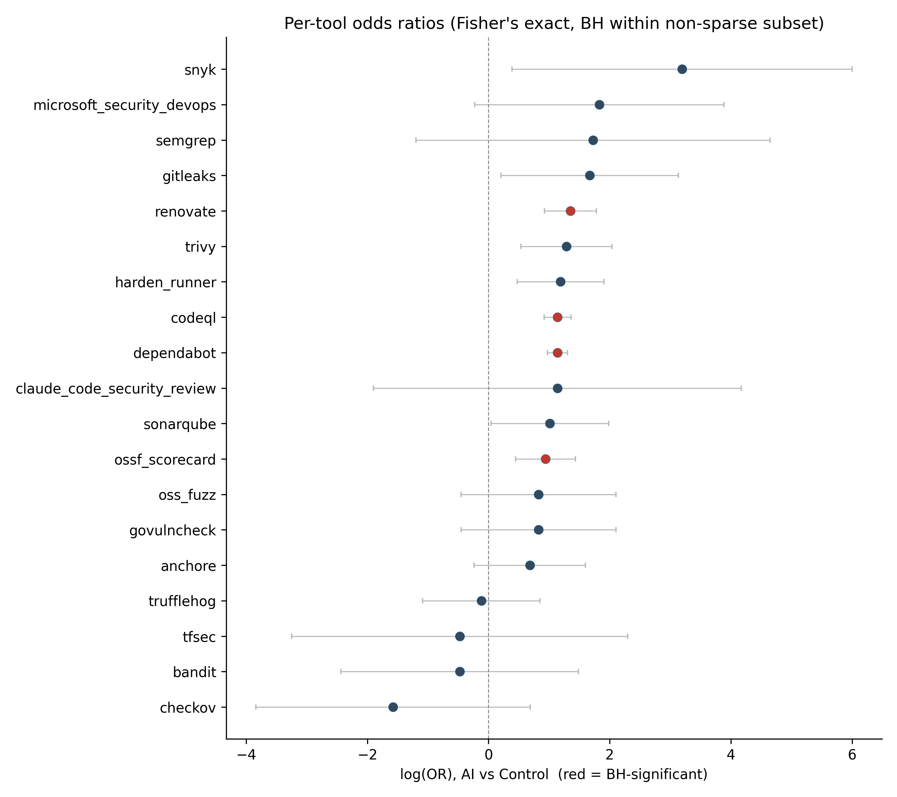

# Security Tooling Adoption & Intervention in AI-Assisted Software Development

Empirical study of how security tooling is **configured** at the repository
level and how security automation **intervenes** at the pull-request level
when AI coding agents (Claude Code, Devin, Cursor, Codex, …) ship code.
Built on the [AIDev v3 dataset](https://huggingface.co/datasets/hao-li/AIDev)
(current subset: ≥100-star repos, from 2025-01-01 to 2025-07-31)
plus a matched control cohort of repositories with no observed agentic
PRs, fetched from GitHub API.

The study answers three questions:

- **RQ1** — How widely are security tools configured across repositories
  with agentic PR activity?
- **RQ2** — Are security tools configured at *different* rates in AI repos
  versus matched non-AI controls?
- **RQ3** — Do agentic PRs receive different security interventions (and
  outcomes) than human PRs in the same repos?

Design is matched at the repo level (RQ2, CEM on language × stars × age ×
owner type) and within-repo at the PR level (RQ3, repo fixed effects on
agentic vs human PRs). All hypothesis tests pre-declared in
[`docs/STUDY_DESIGN.md §7`](docs/STUDY_DESIGN.md). The full report
is at [`analysis/REPORT.md`](analysis/REPORT.md).

---

## Results

Numbers below are read directly from the headline JSONs under
`analysis/tables/`. The cohort is **2,803 AI repos** + **1,744 matched
controls**, with **13,249 PRs** entering the within-repo RQ3 frame after
the singleton-repo drop.

### RQ1 — Configured adoption (AI repos)

40.4% of AI repos configure ≥1 security tool. Source:
[`rq1_headline.json`](analysis/tables/rq1_headline.json).

| Category | Adoption |
|---|---|
| SCA (top) | **34.8%** |
| SAST | 17.5% |
| CI hardening | 3.5% |
| Secrets scanning | 1.0% |
| Fuzzing (bottom) | **0.4%** |

Top-3 tools: Dependabot 29.7%, CodeQL 16.7%, Renovate 5.3%.

<p align="center">
  
</p>

### RQ2 — AI repos vs matched controls

3 categories and 4 tools are significantly more common in AI repos
(Benjamini–Hochberg-adjusted Fisher's exact, all p_adj < 1e-4). Source:
[`rq2_headline.json`](analysis/tables/rq2_headline.json).

| Tool | OR (95% CI) | p_adj |
|---|---|---|
| Renovate | 3.86 (2.52, 5.92) | 3.4e-12 |
| CodeQL | 3.13 (2.51, 3.90) | 7.2e-28 |
| Dependabot | 3.12 (2.65, 3.69) | 4.1e-46 |
| OSSF Scorecard | 2.57 (1.57, 4.20) | 7.0e-05 |

Categories with the same direction: **SCA** (OR 3.36), **SAST** (OR 3.12),
**CI hardening** (OR 2.87). 15 sparse-band tools (e.g., Semgrep, Snyk,
Trivy, Gitleaks) were excluded from BH testing for low cell counts; as shown in the figures below.

<p align="center">
  
  
</p>

### RQ3 — Agentic vs human PRs (same repos)

Agentic PRs receive **fewer** security interventions than human PRs in the
same repos, but are **far more likely to be rejected**. Source:
[`rq3_headline.json`](analysis/tables/rq3_headline.json).

| Outcome | Effect | 95% CI | p | Model |
|---|---|---|---|---|
| any security intervention | **OR = 0.54** | (0.37, 0.79) | 0.0012 | logit + repo FE |
| security intervention count | **IRR = 0.69** | (0.49, 0.97) | 0.031 | Poisson (NB fallback) |
| PR rejected (closed unmerged) | **OR = 6.72** | (4.59, 9.84) | 1.2e-22 | logit + repo FE |

<p align="center">
  
</p>

### Figures

All figures are in [`analysis/figures/`](analysis/figures/) directory as paired
PNG + PDF.

- RQ1: [adoption by category](analysis/figures/rq1_adoption_by_category.png) ·
  [adoption by tool](analysis/figures/rq1_adoption_by_tool.png) ·
  [adoption by language](analysis/figures/rq1_adoption_by_language.png)
- RQ2: [category rates](analysis/figures/rq2_category_rates.png) ·
  [tool forest plot](analysis/figures/rq2_tool_forest.png)
- RQ3: [outcomes forest plot](analysis/figures/rq3_outcomes_forest.png) ·
  [per-repo intervention rates](analysis/figures/rq3_per_repo_rates.png)

---

## Requirements

- **Python 3.11+** managed by [`uv`](https://docs.astral.sh/uv/) — `uv.lock`
  is committed and is part of the reproducibility contract.
- **GitHub personal access token** (`public_repo` scope) for the control
  cohort + tooling-detection passes.
- **Hugging Face token** with read access to the AIDev dataset.
- **~30 GB free disk** for the AIDev parquet snapshot
  (`data_raw/aidev/`) and the GitHub response cache
  (`data_raw/github_cache/`).
- **Node.js 18+** (optional) — only required for the GitHub MCP server
  used by the agent-driven workflow in [`SETUP.md`](SETUP.md). The raw
  scripts under `analysis/scripts/` run standalone without it.
- **Claude Code** (optional) — the subagent recipes in
  [`CLAUDE.md`](CLAUDE.md) are convenience wrappers; everything is
  reproducible without them.

---

## Instructions

### 1. Clone and install

```bash
git clone https://github.com/huytran088/AIDev-security-study.git # HTTPS
cd AIDev-security-study
uv sync           # installs pinned deps from uv.lock
```

### 2. Configure environment

Create `.env` at the repo root with the following starter content. Fill in
the token and dataset-record fields with your own values; the seed and
window are the published defaults and should not be changed for a
reproduction run.

```dotenv
# Authentication
GITHUB_TOKEN=ghp_xxxxxxxxxxxxxxxxxxxxxxxxxxxx
HF_TOKEN=hf_xxxxxxxxxxxxxxxxxxxxxxxxxxxx

# Reproducibility
RANDOM_SEED=42
WINDOW_START=2025-01-01
WINDOW_END=2025-07-31

# AIDev dataset pinning (see https://zenodo.org/records/16919272)
AIDEV_DATASET_VERSION=v3
AIDEV_DATASET_RECORD_ID=16919272
AIDEV_DATASET_DOI=10.5281/zenodo.16919272
```

### 3. Pull the AIDev dataset from Hugging Face

```bash
mkdir data_raw/  # Make one if you don't have the folder
uv run python -c "
from huggingface_hub import snapshot_download
snapshot_download(
    repo_id='hao-li/AIDev',
    repo_type='dataset',
    local_dir='data_raw/aidev',
    revision='v3',
)
"
```

This populates `data_raw/aidev/*.parquet` (`pull_request`,
`pr_comments`, `pr_reviews`, `pr_review_comments_v2`, `all_repository`, etc.)

### 4. Run the phases

Each phase writes to `data_derived/<YYYY-MM-DD>/` and updates the
`data_derived/latest` symlink. GitHub responses are cached under
`data_raw/github_cache/`, so re-runs hit cache by default.

```bash
# Phase A — AI cohort + agentic PR table
uv run python analysis/scripts/phase_a_cohort.py

# Phase B — matched control cohort (CEM + SMD diagnostics)
uv run python analysis/scripts/phase_b_match.py

# Phase C — security tooling detection on AI + control repos
uv run python analysis/scripts/phase_c_tooling.py

# Phase D — RQ3 within-repo human PR sample + intervention classification
uv run python analysis/scripts/phase_d_interventions.py

# Phase E — analysis: power, RQ1/2/3 tables, robustness, post-hoc power, report
uv run python analysis/scripts/power_analysis_pre.py
uv run python analysis/scripts/rq1_compute.py
uv run python analysis/scripts/rq2_compute.py
uv run python analysis/scripts/rq3_compute.py
uv run python analysis/scripts/robustness.py
uv run python analysis/scripts/power_analysis_post.py
uv run python analysis/scripts/build_report.py
```

Or run end-to-end in one shot:

```bash
bash analysis/scripts/build_all.sh
```

After the pipeline completes, headline tables land under
[`analysis/tables/`](analysis/tables/), figures under
[`analysis/figures/`](analysis/figures/), and the rendered narrative at
[`analysis/REPORT.md`](analysis/REPORT.md).

---

## Pre-built derived data

Re-running Phases A–D end-to-end against the GitHub API takes several
hours and burns rate-limit budget. The full
`data_derived/<YYYY-MM-DD>/` tree from the run that backs this README is
released as an anonymous Google Drive archive — **link to be added on
publication**.

To use the snapshot, download the archive, unpack it into `data_derived/`
so it lives at `data_derived/<YYYY-MM-DD>/`, and update the symlink:

```bash
ln -sfn <YYYY-MM-DD> data_derived/latest
```

You can then skip directly to Phase E (`rq{1,2,3}_compute.py` etc.) and
reproduce all tables, figures, and `REPORT.md` locally in a few minutes.

---

## Repository layout

```
analysis/
  scripts/      Phase A–E pipeline scripts
  tables/       Headline CSVs + *_headline.json files
  figures/      Paired PNG + PDF for every figure
  REPORT.md     Generated Report (Jinja template + canonical CSVs)
configs/        Versioned rule sets (tools, bots, fingerprints, patterns)
data_raw/
  aidev/        AIDev parquet snapshot (download target, gitignored)
  github_cache/ Cached GitHub API responses (gitignored)
data_derived/   Per-run outputs; <YYYY-MM-DD>/ + 'latest' symlink
docs/           STUDY_DESIGN.md (full protocol)
notebooks/      Tutorial notebooks (Jupytext-paired)
.claude/        Claude Code subagents, hooks, skills (optional)
```

For details on the directory structure, the Claude Code hooks, and the
agent allowlists, see [`SETUP.md`](SETUP.md).

---

## Study design and citation

The full protocol (research questions, operational definitions, runbook,
statistical plan, rule sets, robustness checks, threats to validity) is
in [`docs/STUDY_DESIGN.md`](docs/STUDY_DESIGN.md). Pre-registered tests
are listed in §7 of that document.

If you build on this work, please cite the AIDev dataset along with this
study:

```bibtex
@misc{aidev-security-study,
  title  = {{Security Tooling Adoption \& Intervention in AI-Assisted Software Development}},
  author = {Huy Tran},
  year   = {2026},
  note   = {Anonymous submission},
}

@misc{li2025aidev,
  title  = {{AIDev: Studying AI Coding Agents on GitHub}},
  author = {Li, Hao and others},
  year   = {2025},
  eprint = {2507.15003},
  doi    = {10.5281/zenodo.16919272},
}
```

---

## License

MIT — see [`LICENSE`](LICENSE). The AIDev dataset itself is released under
CC BY 4.0 by its authors and remains subject to the original repositories'
licenses; see [`data_raw/aidev/README.md`](@hao_li/aidev/README.md) for
details.
