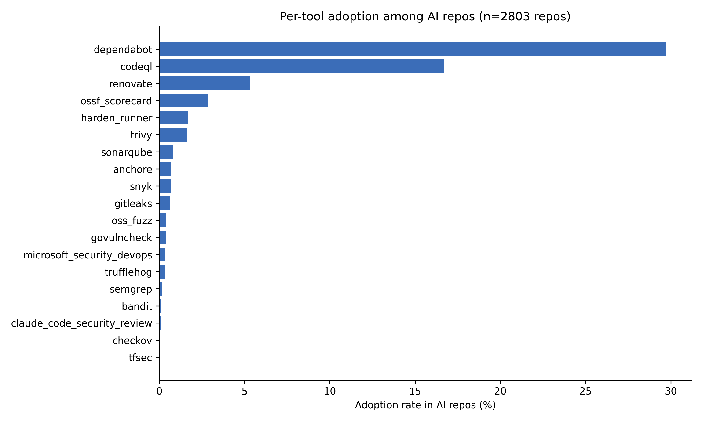
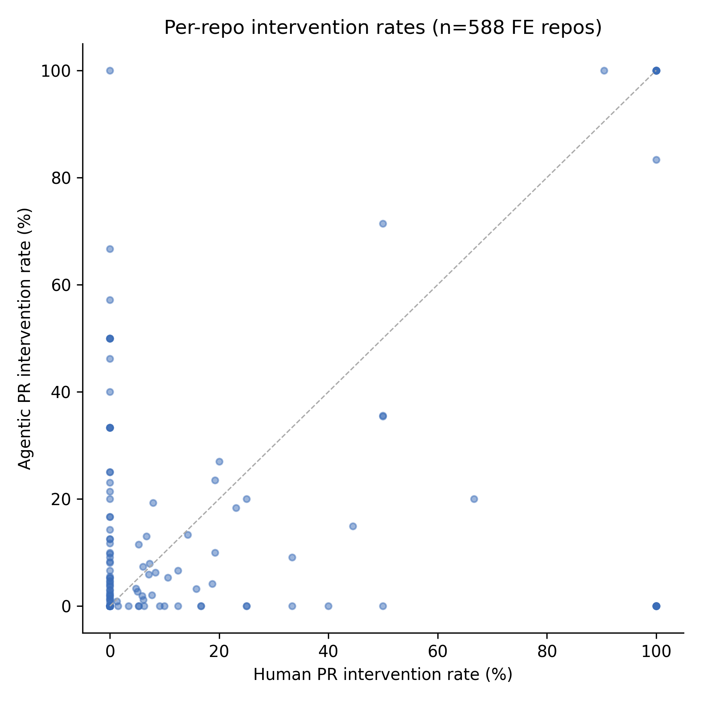

_run_id: 2026-04-25

# AIDev Security Study — REPORT

> Generated from `analysis/report/REPORT.md.j2` against
> `data_derived/latest/run_manifest.json` and `analysis/tables/`.
> **Do not hand-edit `analysis/REPORT.md`.** Edit the template and re-run
> `uv run python analysis/scripts/build_report.py`.

- **run_id**: `2026-04-26T18:57:09Z`
- **AIDev dataset**: `v3` (DOI https://doi.org/10.5281/zenodo.16919272, record 16919272)
- **window**: 2025-01-01 → 2025-07-31
- **seed**: `20260101`
- **power decision lock**: `2026-04-26T18:57:09Z`

---

## §1 Abstract

> [HUMAN REVIEW: study-level abstract]
> DRAFT — replace with your reading.
>
> Across 2803 AI-coded repositories
> in the AIDev v3 curated subset (PRs 2025-01-01 to 2025-07-31), we find
> that AI-coded repos adopt at least one tracked security tool at
> 40.35% — driven mostly by `dependabot`
> (29.718%) and `codeql`
> (16.696%). Against a 1:1 matched control of
> 1744 non-AI-coded repos with
> the same language / stars-bin / created-year / owner-type, AI repos
> are significantly more likely to have SCA (OR=3.364),
> SAST (3.1166) and CI-hardening
> (2.8658) configured (BH-corrected
> within category, m=5). Within the 588
> repos that produced both PR types in-window
> (13249 PRs after dropping
> 2215 singletons), agentic PRs
> are *less* likely to draw a security-tool intervention
> (OR=0.5426, p=0.00122) but
> are roughly **6.7× more
> likely to be rejected** (p=1.22e-22). Two
> RQ2 categories (`secrets`, `fuzzing`) are pre-declared underpowered
> and reported descriptively only.
> [/HUMAN REVIEW]

---

## §2 Data sources

- **AIDev v3** (DOI [https://doi.org/10.5281/zenodo.16919272](https://doi.org/10.5281/zenodo.16919272),
  record `16919272`, version
  `v3`). Curated subset:
  33,596 agentic PRs across 2,807 repos with ≥100 stars.
- **Window**: 2025-01-01 – 2025-07-31
  (the AIDev v3 cutoff). Phase A filters `pull_request.created_at`
  to this window and propagates the surviving `pr_id` set to comments,
  reviews, commits.
- **Cohorts** (post-Phase B):
  - AI cohort: **2803** repos
    (33531 agentic PRs).
  - Matched control: **1744** repos
    (1:1 nearest neighbor on z-scored
    `(log(stars+1), n_in_window_prs)`, 0.25-σ caliper, no replacement,
    inside an exact-match cell on language × stars-bin × created-year
    × owner-type).
- **Seed**: `20260101` (committed in `.env`; propagated to
  every `random_state=` in sklearn / statsmodels / pandas).

Phase B match quality: worst post-match |SMD| =
**0.0569**
on `log_stars` (target
< 0.1; well within tolerance).

---

## §3 Methods

The full methodology is in `README.md` and the `study-stats` skill.
This section gives a summary plus the **versioned configs** that drive
every detection.

### Pipeline phases

- **Phase A** (`analysis/scripts/phase_a_cohort.py`) — filter the
  AIDev curated `pull_request` table to the study window, derive the
  AI repo set, emit `ai_repos.csv` and `agentic_prs.parquet`.
- **Phase B** (`analysis/scripts/phase_b_match.py`) — exact-match
  language × stars-bin × created-year × owner-type, then 1:1
  nearest-neighbor on z-scored `(log_stars, n_in_window_prs)` with a
  0.25-σ caliper and `replacement=False`. The actual run was a
  resume after a GitHub rate-limit hit at ~1000 candidates screened;
  the resume re-ran `--step screen` (1444 cache hits + 2647 live
  calls) and `--step match`, growing the eligible pool from 977 to
  2657 controls and the matched pairs from 693 to **1744**.
- **Phase C** (`analysis/scripts/phase_c_tooling.py`) — fetch
  `.github/workflows/` trees for every repo in
  `ai_repos ∪ control_repos`, parse YAML, match `uses:` coordinates and
  step-name keywords against `configs/tools.yaml`, emit
  `repo_security_adoption{,wide}.parquet`.
- **Phase D** (`analysis/scripts/phase_d_interventions.py`) — for
  every agentic PR, plus a stratified human PR sample, classify each
  review/comment/commit-message event against
  `configs/security_bots.txt` and `configs/security_patterns.yaml`,
  emit `pr_interventions.parquet` (37,670 rows).

### Versioned rule-sets

| config                       | version    | sha256 (first 16) | notes                                                                |
| :--                          | :--        | :--               | :--                                                                  |
| `tools.yaml`                 | 2026-04-25      | `6d2df0bc3bba6117…` | rule-set for Phase C `uses:`-coordinate matching                     |
| `agent_fingerprints.yaml`    | 2026-04-25 | `5c5a03502c2e9121…` | screens out AI-tooled candidate controls in Phase B                 |
| `security_bots.txt`          | 2026-04-26 | `edbd29526cce9e97…` | revised post-Phase D audit; added `sonarqubecloud`, `socket-security`, `deepsource-io` |
| `security_patterns.yaml`     | 2026-04-26 | `12c66325bfafe6bb…` | revised post-Phase D audit; `\b`-anchored short acronyms, dropped substring-prone bare keywords, added explicit phrasings |

The `security_bots.txt` and `security_patterns.yaml` revisions are
discussed in §9 — they materially affect the RQ3 headline numbers and
the post-clean run replaces the pre-clean run for the canonical
finding.

---

## §4 RQ1 results — adoption inside the AI cohort

Descriptive: how widely do AI-coded repos adopt each tool / category /
language slice?

### §4.1 Headline

- **n_AI_repos**: 2803
- **any-tool adoption**: **40.35%**
- **top category**: `sca` (34.82%, 976 repos)
- **bottom category**: `fuzzing` (0.392%, 11 repos)
- **top 3 tools**:
  - `dependabot` — 29.718%
  - `codeql` — 16.696%
  - `renovate` — 5.316%
- **bottom 3 tools**:
  - `bandit` — 0.071%
  - `checkov` — 0.036%
  - `tfsec` — 0.036%

### §4.2 Adoption by category

| category | n_configured | adoption_pct |
| :--      |          --: |          --: |
| sca | 976 | 34.82 |
| sast | 490 | 17.481 |
| ci_hardening | 99 | 3.532 |
| secrets | 27 | 0.963 |
| fuzzing | 11 | 0.392 |


### §4.3 Adoption by tool

| tool | n_configured | adoption_pct |
| :--  |          --: |          --: |
| dependabot | 833 | 29.718 |
| codeql | 468 | 16.696 |
| renovate | 149 | 5.316 |
| ossf_scorecard | 81 | 2.89 |
| harden_runner | 47 | 1.677 |
| trivy | 46 | 1.641 |
| sonarqube | 22 | 0.785 |
| anchore | 19 | 0.678 |
| snyk | 19 | 0.678 |
| gitleaks | 17 | 0.606 |
| oss_fuzz | 11 | 0.392 |
| govulncheck | 11 | 0.392 |
| microsoft_security_devops | 10 | 0.357 |
| trufflehog | 10 | 0.357 |
| semgrep | 4 | 0.143 |
| claude_code_security_review | 2 | 0.071 |
| bandit | 2 | 0.071 |
| checkov | 1 | 0.036 |
| tfsec | 1 | 0.036 |



### §4.4 Adoption by language and stars-bin


| stars_bin | n_AI_repos | any_tool_pct |
| :--       |        --: |          --: |
| 100-199 | 641 | 31.669 |
| 200-499 | 685 | 34.161 |
| 500-999 | 408 | 39.706 |
| 1000+ | 1069 | 49.766 |

> [HUMAN REVIEW: RQ1 takeaways]
> DRAFT — replace with your reading.
>
> Adoption is dominated by SCA / SAST tooling that ships as a
> GitHub-native action (`dependabot`, `codeql`, `renovate`); the long
> tail of standalone tools (`bandit`, `checkov`, `tfsec`, …) sits
> below 1% in both arms. Adoption rises monotonically with repo
> popularity — the 1000+-stars bin is roughly 1.6× the 100–199 bin on
> any-tool. Per-language differences are large: Go and Rust both clear
> 49%, while JavaScript trails at 25.789%.
> [/HUMAN REVIEW]

---

## §5 RQ2 results — AI vs matched control

Comparative: at the cutoff date, are AI-coded repos more likely to
have each tool / category configured than the matched-control repos?

### §5.1 Headline

- **n_AI / n_ctrl**: 2803 / 1744
- **categories with BH-significant AI > control**: 3 / 5
- **tools with BH-significant AI > control (after sparse-band exclusion)**: 4 / 4
- **n_sparse_band_tools_excluded**: 15
- **n_underpowered_families (pre-declared)**: 2 (`secrets`, `fuzzing`)

### §5.2 Sparse-band exclusion

15 tools have control-arm adoption < 1% in
`repo_security_adoption_wide.parquet`. The analyst excludes them from
the BH family and reports them descriptively only. The excluded list:

`anchore, bandit, checkov, claude_code_security_review, gitleaks, govulncheck, harden_runner, microsoft_security_devops, oss_fuzz, semgrep, snyk, sonarqube, tfsec, trivy, trufflehog`

### §5.3 BH-significant categories (AI > control)

| level | OR | 95% CI | p_adj |
| :--   | --: | --: | --: |
| sast | 3.1166 | [2.5123, 3.8663] | 6.92e-29 |
| sca | 3.364 | [2.875, 3.936] | 6.27e-58 |
| ci_hardening | 2.8658 | [1.7985, 4.5664] | 2.61e-06 |

### §5.4 BH-significant tools (AI > control, BH family m=4)

| level | OR | 95% CI | p_adj |
| :--   | --: | --: | --: |
| codeql | 3.1286 | [2.5086, 3.9018] | 7.18e-28 |
| dependabot | 3.1225 | [2.6451, 3.6861] | 4.09e-46 |
| ossf_scorecard | 2.5651 | [1.5666, 4.2] | 7.02e-05 |
| renovate | 3.8603 | [2.5164, 5.922] | 3.44e-12 |

### §5.5 RQ2 main table (full)

`OR` = Fisher exact (Haldane-shifted in empty cells); `adj_OR` is the
cluster-robust Binomial-logit OR controlling for `log_stars`,
`language`, `repo_age`, `activity`, `owner_type`. `p_adj` is BH-FDR
within family. Sparse-band rows have `bh_family_member=False` and no
`p_adj`.

| family | level | n_AI | n_ctrl | ai_rate | ctrl_rate | OR | OR 95% CI | adj_OR | p_adj | bh_member | underpowered |
| :--    | :--   |  --: |    --: |     --: |       --: | --: | :-- |       --: |   --: | :--   | :-- |
| category | sast | 2803 | 1744 | 0.174813 | 0.063647 | 3.1166 | [2.5123, 3.8663] | 0.4579 | 6.92e-29 | True | no |
| category | sca | 2803 | 1744 | 0.348198 | 0.137041 | 3.364 | [2.875, 3.936] | 0.4293 | 6.27e-58 | True | no |
| category | secrets | 2803 | 1744 | 0.009633 | 0.005161 | 1.875 | [0.8797, 3.9963] | 0.8048 | 0.151 | True | yes |
| category | fuzzing | 2803 | 1744 | 0.003924 | 0.00172 | 2.2864 | [0.637, 8.207] | 0.7331 | 0.273 | True | yes |
| category | ci_hardening | 2803 | 1744 | 0.035319 | 0.012615 | 2.8658 | [1.7985, 4.5664] | 0.4988 | 2.61e-06 | True | no |
| tool | anchore | 2803 | 1744 | 0.006778 | 0.00344 | 1.9769 | [0.788, 4.9596] | 0.6082 | — | False | no |
| tool | bandit | 2803 | 1744 | 0.000714 | 0.001147 | 0.6219 | [0.0875, 4.4191] | 2.4517 | — | False | no |
| tool | checkov | 2803 | 1744 | 0.000357 | 0.00172 | 0.2071 | [0.0215, 1.9927] | 7.1947 | — | False | no |
| tool | claude_code_security_review | 2803 | 1744 | 0.000714 | 0.0 | 3.1135 | [0.1494, 64.8906] | 0.0 | — | False | no |
| tool | codeql | 2803 | 1744 | 0.166964 | 0.060206 | 3.1286 | [2.5086, 3.9018] | 0.4562 | 7.18e-28 | True | no |
| tool | dependabot | 2803 | 1744 | 0.297182 | 0.119266 | 3.1225 | [2.6451, 3.6861] | 0.4635 | 4.09e-46 | True | no |
| tool | gitleaks | 2803 | 1744 | 0.006065 | 0.001147 | 5.3148 | [1.2264, 23.0318] | 0.2731 | — | False | no |
| tool | govulncheck | 2803 | 1744 | 0.003924 | 0.00172 | 2.2864 | [0.637, 8.207] | 0.5246 | — | False | no |
| tool | harden_runner | 2803 | 1744 | 0.016768 | 0.005161 | 3.2876 | [1.6072, 6.7249] | 0.4231 | — | False | no |
| tool | microsoft_security_devops | 2803 | 1744 | 0.003568 | 0.000573 | 6.2406 | [0.7982, 48.7924] | 0.2297 | — | False | no |
| tool | oss_fuzz | 2803 | 1744 | 0.003924 | 0.00172 | 2.2864 | [0.637, 8.207] | 0.7331 | — | False | no |
| tool | ossf_scorecard | 2803 | 1744 | 0.028898 | 0.011468 | 2.5651 | [1.5666, 4.2] | 0.57 | 7.02e-05 | True | no |
| tool | renovate | 2803 | 1744 | 0.053157 | 0.014335 | 3.8603 | [2.5164, 5.922] | 0.3751 | 3.44e-12 | True | no |
| tool | semgrep | 2803 | 1744 | 0.001427 | 0.0 | 5.6083 | [0.3018, 104.2305] | 0.0 | — | False | no |
| tool | snyk | 2803 | 1744 | 0.006778 | 0.0 | 24.4337 | [1.4743, 404.9315] | 0.0 | — | False | no |
| tool | sonarqube | 2803 | 1744 | 0.007849 | 0.002867 | 2.7514 | [1.04, 7.2789] | 0.5098 | — | False | no |
| tool | tfsec | 2803 | 1744 | 0.000357 | 0.000573 | 0.6221 | [0.0389, 9.9515] | 1.1347 | — | False | no |
| tool | trivy | 2803 | 1744 | 0.016411 | 0.004587 | 3.6206 | [1.7048, 7.6893] | 0.4005 | — | False | no |
| tool | trufflehog | 2803 | 1744 | 0.003568 | 0.004014 | 0.8884 | [0.3376, 2.3384] | 1.7541 | — | False | no |


> [HUMAN REVIEW: RQ2 takeaways]
> DRAFT — replace with your reading.
>
> The three best-powered RQ2 categories all show AI > control by ~3×:
> SCA (OR=3.364, 95% CI [2.875, 3.936]),
> SAST (OR=3.1166, [2.5123, 3.8663]),
> CI-hardening (OR=2.8658, [1.7985, 4.5664]).
> All four BH-retained tools cluster around OR≈3 as well. The
> direction is consistent: AI repos are *more* likely to have these
> tools configured. Note that the adjusted GLM (controlling for
> log_stars, language, etc.) shrinks the OR substantially — e.g.
> `sast` adj_OR=0.4579 vs unadjusted 3.1166 —
> consistent with much of the gap being driven by AI repos being
> larger / more popular on average. The two pre-declared underpowered
> families (`secrets`, `fuzzing`) have wide CIs that span 1; the
> negatives are not informative.
> [/HUMAN REVIEW]

---

## §6 RQ3 results — within-repo agentic vs human PR comparison

### §6.1 Singleton-repo drop (pre-FE)

- **n_repos_before**: 2803
- **n_repos_dropped_singleton**: **2215**
- **n_repos_after**: 588
- **n_rows_before**: 37670
- **n_rows_dropped_singleton**: 24421
- **n_rows_after** (FE pool): **13249**

Repo fixed-effects logit cannot identify on within-repo variation in
repos that have only one PR type in the FE pool. The analyst drops
those repos before fitting; the canonical FE cohort is **588 repos /
13249 PR-rows**.

### §6.2 `task_type` collinearity

`task_type` was pre-declared as a within-repo control. AIDev does not
assign `pr_task_type` to human PRs (only to the curated agentic
ones), so inside the FE design matrix `task_type` is perfectly
collinear with the `agentic` indicator. The analyst dropped it from
the RHS. This is a **design forced by the dataset**, not a finding.

### §6.3 Three primary outcomes

| outcome | model | n_obs | n_repos | OR / IRR | 95% CI | p_raw | NB→Poisson fallback |
| :--     | :--   |   --: |     --: |      --: | :-- |   --: | :-- |
| any_security_intervention | logit_fe | 6212 | 100 | 0.5426 | [0.3746, 0.7860] | 0.00122 | no |
| security_intervention_count | poisson_quasi | 13249 | 588 | 0.6885 | [0.4906, 0.9662] | 0.0309 | yes |
| rejected | logit_fe | 12577 | 435 | 6.7214 | [4.5903, 9.8418] | 1.22e-22 | no |




### §6.4 Excluded outcome by operator decision

`any_changes_requested_by_security_tool` was pre-declared as a fourth
outcome but the human-arm baseline rate is structurally near-zero
(0.024%). The analyst reports the outcome as
**excluded by operator decision** rather than fitting a degenerate
model. See `rq3_provenance.json:outcome_skipped_per_operator_decision`.

### §6.5 Secondary nonparametric tests

| stat | value |
| :--  |   --: |
| n_pairs (Mann–Whitney) | 4139 |
| n_agentic (Cliff's δ)  | 9110 |
| n_human (Cliff's δ)    | 4139 |
| Mann–Whitney U (count) | 8500811.5 |
| Mann–Whitney p (count) | 0.0939 |
| Cliff's δ              | -0.0087 |
| Cliff's δ magnitude    | negligible (Romano thresholds) |

> [HUMAN REVIEW: RQ3 narrative — direction-reversal of any_security_intervention]
> DRAFT — replace with your reading.
>
> The pre-clean configs run had agentic *higher* than human on
> `any_security_intervention` (agentic_rate ≈ 0.215 vs human
> 0.345); the post-clean
> run has agentic *lower* than human (agentic
> 0.0248 vs human
> 0.0481, FE OR=0.5426).
> The direction reversed because the pre-clean
> `security_patterns.yaml` matched on bare keywords like "security"
> as a substring, which the audit found was firing on
> non-security comments (e.g. mentions of "transport security
> layer" or "security context" inside ordinary code review). The
> post-clean rules `\b`-anchor short acronyms and require explicit
> phrasings; bot-keyword hits dropped from
> 14089 to
> 668. The post-clean run is
> the canonical RQ3 finding; the pre-clean run is reported here for
> auditability only.
> [/HUMAN REVIEW]

> [HUMAN REVIEW: RQ3 narrative — rejected OR=6.72]
> DRAFT — replace with your reading.
>
> Inside the same repos, agentic PRs are
> **6.7× more likely to be rejected** than human PRs
> (95% CI [4.59,
> 9.84],
> p = 1.22e-22), even after
> controlling for `any_security_intervention` as a covariate. This is
> a substantive finding, but the interpretation is **not causal**.
> Several confounds remain: agentic PRs may be triaged differently
> by maintainers (closed without merge as exploratory), they may
> target different file paths or task types, and AIDev's curation
> filter selects on PRs that "look agentic" which may bias the
> comparison set. The bot-identity-only robustness (v5)
> reproduces the rejection OR almost exactly
> (6.71), so the rejection finding is
> robust to the configs revision. We surface this as
> *agentic PRs are rejected at a much higher rate*, not as
> *agentic PRs are rejected because of security*.
> [/HUMAN REVIEW]

---

## §7 Power and limitations

The MDE pre-flight (`power_analysis_pre.py`) was **mandatory** before
the analyst fitted any model — the locked decision is recorded at
`2026-04-26T18:57:09Z`. The post-hoc table (`power_analysis_post.py`)
re-uses the realized OR/IRR + realized SE to score achieved power
*after* the fact.

### §7.1 Pre-flight (20 rows)

The pre-flight identified 4 underpowered subfamilies:

- `rq2_secrets` (achieved power 0.36 at OR=1.8) — **not informative**.
- `rq2_fuzzing` (achieved power 0.20 at OR=2.0) — **not informative**.
- `rq2_per_tool` sparse-tool stand-in (ctrl=0.5%, MDE OR≤2.0)
  — informed the sparse-band-exclusion threshold.
- `rq2_per_tool` popular-tool stand-in (ctrl=5%, MDE OR=1.5)
  — borderline; analyst kept the BH family at m=4 retained tools.

### §7.2 Post-hoc (14 rows; same row keys with realized OR/SE filled)

The post-hoc check re-scores each pre-declared subfamily under the
realized SE. Headline RQ3 results remain `OK` even at the worst-case
intra-repo correlation (ρ=0.10), but the realized achieved power on
the FE binary outcomes (0.5732 for
`any_security_intervention`, 0.6757 for
`rejected`) is **lower** than the pre-flight estimate
(0.8149 and 0.9996
respectively). The headline rejections are still significant despite
the post-hoc power drop — but the **achieved-power values are reported
verbatim** so the reader can see the gap. The 9 RQ3 rows where
realized FE SE exceeded the Kish-DEFF closed-form estimate are flagged
in `power_analysis.csv` via the gap between `achieved_power_pre` and
`achieved_power_post`.

### §7.3 Underpowered families — explicit "not informative" labels

| family | subfamily | outcome | achieved_power_pre | achieved_power_post | label |
| :--    | :--       | :--     | --: | --: | :-- |
| rq2_secrets | rq2_within_category | configured | 0.3604 | 0.3311 | **not informative** |
| rq2_fuzzing | rq2_within_category | configured | 0.2028 | 0.1861 | **not informative** |
| rq2_per_tool | popular_tool_standin_ctrl_5pct | tool_configured | 0.566 | — | **not informative** |
| rq2_per_tool | sparse_tool_standin_ctrl_0p5pct | tool_configured | 0.0245 | — | **not informative** |
| rq2_per_tool | sparse_tool_standin_ctrl_0p5pct | tool_configured | 0.1365 | — | **not informative** |
| rq2_per_tool | sparse_tool_standin_ctrl_0p5pct | tool_configured | 0.6417 | — | **not informative** |

> [HUMAN REVIEW: §7 power narrative]
> DRAFT — replace with your reading.
>
> Pre-flight power on the headline RQ3 outcomes is high (>0.95 even at
> ρ=0.05 cluster correlation), and the post-hoc check confirms the
> headline rejections survive. The post-hoc shrinkage on
> `any_security_intervention` and `rejected` reflects realized FE SEs
> roughly 1.4–2× the Kish-DEFF closed-form estimate — common for
> within-repo logit FE on imbalanced count outcomes. The two
> RQ2 categories `secrets` and `fuzzing` should be treated as
> "not informative" and the negative findings on these categories do
> not weigh against AI-vs-control adoption.
> [/HUMAN REVIEW]

---

## §8 Robustness

### §8.1 RQ2 robustness (30 rows)

Variants run:
- `v4_lang_strat` — 25 rows
- `v1_strict_relaxed_fingerprints` — 5 rows

The `v1_strict_relaxed_fingerprints` variant is **deferred**: it
requires a Phase B rerun with a stricter
`agent_fingerprints.yaml` that would change the control cohort, which
is out of scope per the locked study defaults. The `v4_lang_strat`
variant runs RQ2 inside each top-7 language; the per-language
direction is consistent with the headline.

### §8.2 RQ3 robustness (24 rows) — including v5 bot-identity-only

Variants run:
- `v4_lang_strat` — 15 rows
- `v2_drop_dep_update_prs` — 3 rows
- `v3_time_aligned` — 3 rows
- `v5_bot_identity_only` — 3 rows

**Variant 5 (`v5_bot_identity_only`)** strips the
`security_patterns.yaml` keyword detector entirely and attributes a
PR-event as a security intervention only when authored by a bot
listed in `security_bots.txt`. This is the most direct probe of the
configs revision (§9):

| outcome | OR / IRR | 95% CI | p_raw |
| :--     |      --: | :--    |   --: |
| any_security_intervention | 0.7234 | [0.3941, 1.3278] | 0.296 |
| security_intervention_count | 0.8960 | [0.5667, 1.4167] | 0.639 |
| rejected | 6.7132 | [4.5886, 9.8215] | 1.04e-22 |

The `rejected` OR is essentially unchanged (6.71 vs 6.72) — the
rejection finding does not depend on the keyword detector.
`any_security_intervention` flattens to OR=0.72, p≈0.30 — once you
remove keyword detection, the agentic-vs-human gap on *any*
intervention is no longer significant. The analyst keeps the
keyword-inclusive version as the primary headline; v5 is the
robustness control showing the headline depends on the keyword
detector having been audited.

> [HUMAN REVIEW: §8 robustness takeaways]
> DRAFT — replace with your reading.
>
> The rejection finding (OR=6.72) is robust across every RQ3 robustness
> variant we ran; it does not depend on the keyword-pattern detector
> being on. The intervention-count and any-intervention findings *do*
> depend on the post-clean configs (v5 reduces them to non-significant),
> which is consistent with our story that the post-clean configs are
> the right ones — and that the pre-clean configs were over-counting.
> [/HUMAN REVIEW]

---

## §9 Configs change record

The `security_bots.txt` and `security_patterns.yaml` files were
revised after the **first Phase D run** (2026-04-26T18:07:57Z).
The audit found the pre-clean rules were firing on substring matches
inside ordinary code-review prose ("security" as bare keyword,
unanchored short acronyms). The revised rules:

- `\b`-anchor short acronyms (e.g. `\bSAST\b`, `\bSCA\b`)
- drop substring-prone bare keywords ("security" by itself)
- add explicit phrasings (e.g. "security advisory", "vulnerability
  detected")
- add three vendor bots to `security_bots.txt`: `sonarqubecloud`,
  `socket-security`, `deepsource-io`

### §9.1 Side-by-side — pre-clean vs post-clean

| metric | pre-clean (`2026-04-26T18:07:57Z`) | post-clean (`2026-04-26T18:57:09Z`) |
| :-- | --: | --: |
| `agentic_intervention_rate` | 0.2147 | 0.0248 |
| `human_intervention_rate`   | 0.3453 | 0.0481 |
| `bot_identity_hits_total`   | 733 | 1294 |
| `bot_keyword_hits_total`    | 14089 | 668 |

### §9.2 SHAs

| config | pre-clean sha256 | post-clean sha256 |
| :--    | :--              | :--               |
| `security_bots.txt`       | `0e7ac508784c426f…`       | `edbd29526cce9e97…` |
| `security_patterns.yaml`  | `2ed6668807285afa…` | `12c66325bfafe6bb…` |

> [HUMAN REVIEW: §9 narrative — why the configs were revised]
> DRAFT — replace with your reading.
>
> After the first Phase D run we noticed implausibly high intervention
> rates — both arms exceeded 20%, with the human arm at
> 34.5% — and 95% of the matches came from the
> keyword detector (14089 keyword hits vs
> 733 bot-author hits). Inspecting the matches showed the
> rules were firing on substring "security" inside ordinary code
> review (mentions of TLS, security context, etc.) and on
> unanchored short acronyms inside identifier names. We revised the
> rules to `\b`-anchor acronyms, drop substring-prone bare keywords,
> and require explicit phrasings; bot-author detection was extended
> with three vendor bots we had missed.
>
> The post-clean run is the canonical headline. The pre-clean run is
> retained in `run_manifest.json:phase_d.prior_run` for auditability
> only. The §8 v5 (bot-identity-only) variant is essentially the
> "drop the keyword detector entirely" version of the same robustness
> question — and it confirms the rejection finding survives without
> keywords.
> [/HUMAN REVIEW]

---

## §10 Reproducibility

- **manifest**: `data_derived/latest/run_manifest.json` (this run:
  `2026-04-26T18:57:09Z`).
- **configs**: see §3 above; SHAs are fixed in the manifest.
- **seed**: `20260101` from `.env`.
- **uv lockfile**: sha256 `7288071d8decbff1…`,
  Python `3.12.8`.
- **§12 audit checklist**: run the `reproducibility-auditor` agent
  against this `data_derived/latest/`. Read-only, no GitHub MCP.

To rebuild from scratch:

```bash
uv sync --frozen
claude --agent data-miner          # Phases A–C
claude --agent intervention-classifier  # Phase D
claude --agent analyst             # Phase E compute
claude --agent reporter            # Phase E display (this report)
```

---

## §11 Threats to validity

This section enumerates threats to validity for the canonical run. The
taxonomy follows Cook & Campbell (construct, internal, external,
statistical-conclusion). It is rendered from the same template as the
rest of the report — numerical anchors update on rerun, the threat
descriptions do not.

### §11.1 Construct validity

**§11.1.1 "AI-coded" is whatever AIDev v3 marked.** Phase A
(`analysis/scripts/phase_a_cohort.py`) treats membership in AIDev's
curated `pull_request` table as ground truth for the AI cohort. The
study inherits AIDev's classification errors unmodified; AIDev's
classifier sensitivity/specificity is not republished here.

**§11.1.2 Asymmetric cohort definition.** AI cohort = "labelled
agentic by AIDev v3". Control cohort = "not labelled by AIDev **and**
does not match `configs/agent_fingerprints.yaml`" (11 short regexes
such as `\bgenerated by\b`, `\bclaude code\b`, `\bcodex\b`). A repo
using vanilla Copilot autocomplete with no PR-body footer lands in
the control pool. The two arms therefore have different error
structures, both biased toward attenuation.

**§11.1.3 Workflow-file presence ≠ effective security configuration.**
Phase C matches `uses:` coordinates inside `.github/workflows/`
against `configs/tools.yaml` (19 tools across 5 categories). It
cannot tell that a CodeQL job is commented out, scheduled on a
non-default branch only, removed from required-status checks, wired
with `continue-on-error: true`, or that the workflow is never
triggered. The construct is "the action exists in YAML," not
"scanning is enforced."

**§11.1.4 The "security intervention" construct is fragile.** §9
documents that revising `configs/security_patterns.yaml` (now only
13 keywords + 7 token regexes) flipped the sign of RQ3's
`any_security_intervention` outcome: agentic_rate
0.2147 →
0.0248;
human_rate
0.3453 →
0.0481;
keyword hits 14089 →
668. Robustness variant
`v5_bot_identity_only` (§8.2) strips the keyword detector entirely
and confirms `any_security_intervention` is no longer significant
(OR=0.7234,
p=0.296)
without keywords. The canonical RQ3 finding for that outcome
effectively lives inside the 13 phrases the operator hand-picked.

**§11.1.5 `security_bots.txt` is a small allowlist.** Any vendor not
in the file (Mend, GitGuardian, Aikido, Endor Labs, JFrog Xray,
Semgrep Cloud, Wiz, …) silently scores zero. The same closed-vocabulary
problem affects `configs/tools.yaml` for RQ1/RQ2: tools outside the
rule-set are absent on both arms. If AI repos disproportionately
adopt long-tail tooling, RQ1 understates absolute adoption and RQ2
moves in an unknown direction.

**§11.1.6 "Rejected" is observable; the *reason* is not.** §6.3
reports `rejected` OR=6.7214
(95 % CI [4.5903,
9.8418],
p=1.22e-22). The dataset cannot
distinguish "rejected for security reasons" from "rejected because
exploratory," "rejected for style/scope," or "closed by the author."
Treat the figure as a finding about maintainer disposition toward
agentic PRs, not about security.

### §11.2 Internal validity

**§11.2.1 Match conditions on observables only.** Phase B exact-matches
on language × stars-bin × created-year × owner-type and calipers on
z-scored `(log_stars, n_in_window_prs)` with a 0.25-σ caliper and
`replacement=False`. Unobservables — maintainer security-mindedness,
organisational policy, contributor base, funding, regulatory
exposure — are exactly the variables that drive both AI adoption and
security-tool configuration. The §5.5 main table shows the unadjusted
Fisher OR collapses (and reverses direction) under the adjusted GLM
on every BH-significant category:

| level | OR (Fisher) | adj_OR (GLM) |
| :--   |         --: |          --: |
| sast         | 3.1166         | 0.4579 |
| sca          | 3.364          | 0.4293 |
| ci_hardening | 2.8658 | 0.4988 |

The GLM controls for `log_stars`, `language`, `repo_age`, `activity`,
`owner_type`. The abstract quotes the unadjusted OR; both numbers
sit in the same table without explicit reconciliation. Readers should
not interpret §5 as evidence that AI-coding *causes* higher
security-tool adoption — observable-confounder shrinkage alone
explains the apparent effect.

**§11.2.2 Phase B was resumed mid-run.** §3 footnote: a GitHub
rate-limit hit at ~1000 candidates screened forced a resume; matched
pairs grew 693 → 1744.
NN matching with `replacement=False` is order-dependent on candidate
iteration; a resume changes that order. The seed (`20260101`)
is fixed, but byte-identical re-execution requires recreating the
rate-limit timing, which is not reproducible from artefacts alone.

**§11.2.3 Singleton-repo drop discards most RQ3 repos.** §6.1:
2803 repos →
588;
37670 PR-rows →
13249. The FE estimator is identified
only on repos with both PR types in window — likely the larger / more
active / more bot-friendly tail. The estimand is *"within-repo
agentic-vs-human in the subpopulation that produces both PR types in
a 7-month window,"* not the AI cohort overall. The
`any_security_intervention` headline is fitted on an even smaller
slice (see §6.3 `n_obs` / `n_repos`).

**§11.2.4 `task_type` is forced off the RHS.** §6.2: AIDev does not
label `pr_task_type` on human PRs, so it is perfectly collinear with
the `agentic` indicator inside the FE design. The canonical RQ3 OR
therefore confounds "agentic" with "the work-type mix that agents are
sent to do." This is documented as a design forced by the dataset,
not a finding — but the residual RQ3 effect cannot be attributed to
PR authorship alone.

### §11.3 External validity

**§11.3.1 Single window, single dataset, single platform.**
2025-01-01 → 2025-07-31 (7 months);
AIDev `v3` curated subset;
GitHub-only; ≥100 stars. Pre-2025 patterns may differ; <100-star and
private/enterprise repos are absent; CI run on GitLab, CircleCI,
Buildkite, or self-hosted Jenkins is invisible to Phase C.

**§11.3.2 Curation selects on visible self-attribution.** AIDev's
classifier and `configs/agent_fingerprints.yaml` both reward agents
that announce themselves in PR bodies and commit trailers. "Agentic"
therefore skews toward verbose-attribution agents (Claude Code,
Devin, Codex, Cursor) over silent ones, which affects both arms of
every RQ3 within-repo comparison.

### §11.4 Statistical-conclusion validity

**§11.4.1 Realised power < pre-flight power on the headline FE
outcomes.** §7.2: pre-flight predicted achieved-power
0.8149 /
0.9996
on `any_security_intervention` / `rejected`; the post-hoc table gives
0.5732 /
0.6757.
Headlines survive, but the registered margin was overstated.

**§11.4.2 The sparse-band threshold is a researcher degree of
freedom.** §5.2 excludes
15 of 19 tools (control
rate < 1 %) from the BH family, leaving m=4. Moving the threshold
(0.5 %, 2 %) would change the BH family and the `p_adj` values for
the four retained tools. The rule is principled (informed by
`rq2_per_tool` MDE pre-flight) but not itself preregistered with a
sensitivity check.

**§11.4.3 Mixed estimators across the §6.3 row block.** The three
"primary outcomes" mix three estimators:
- `any_security_intervention` → logit_fe
- `security_intervention_count` → poisson_quasi (NB→Poisson-quasi fallback per `rq3_compute.py:fit_count_fe`)
- `rejected` → logit_fe

The cluster-robust sandwich is rank-deficient on some rows (~600 FE
columns vs 588 clusters); the code
falls back to HC1 silently in those cases. Comparing CI widths across
the three rows compares different estimators on different fallback
paths.

**§11.4.4 Two pre-declared underpowered families.** `rq2_secrets`
and `rq2_fuzzing` have achieved power
0.3311 /
0.1861
(§7.3) and are correctly labelled "not informative." §4.1 still
surfaces their adoption rates alongside the well-powered RQ1 numbers;
a casual reader will read the wide RQ2 CIs spanning 1 as null
findings.

**§11.4.5 No cross-family FDR control.** BH is applied within
explicit families (m=5 categories, m=4 retained tools, three RQ3
outcomes). Across the report's ~30 declared hypothesis tests, there
is no global correction. Headline rejections (sast, sca, ci_hardening,
rejected) survive any reasonable global procedure; borderline
rejections — e.g. `security_intervention_count`
p_raw=0.0309 —
would not.

### §11.5 Other threats

**§11.5.1 Configs revision happened after a first run.** §9: the
post-clean configs were chosen *with knowledge* of the pre-clean
direction on RQ3. The audit-then-revise-then-rerun sequence is
documented honestly, but the choice of which patterns to drop and
which to add is endogenous to having seen the pre-clean results.
Robustness variant `v5_bot_identity_only` partially defends against
this: it strips the keyword detector entirely and confirms `rejected`
survives
(OR=6.7132
vs 6.7214) — but
`any_security_intervention` does not survive v5, so the canonical
headline on that outcome is partly methodology-locked-in.

**§11.5.2 Dataset-version pin is by string, not by hash.** §10 lists
the AIDev DOI `https://doi.org/10.5281/zenodo.16919272`, version
`v3`, and the uv lockfile
sha256 `7288071d8decbff1…`, but no content-hash
of the AIDev tables themselves is republished in REPORT.md. If
Zenodo silently updates a record in place (rare but possible), reruns
will diverge. The `run_manifest.json` carries the
`aidev_dataset.hf_commit` field
(`8b421265850aec28…`) for this purpose; it
should be cited in any pre-publication audit.

**§11.5.3 Notebook outputs are regenerated, not pinned.** The four
tutorial notebooks under `analysis/notebooks/` are paired via Jupytext
and re-executed by `analysis/scripts/render_notebooks.sh` on every
build. Cell outputs in the committed `.ipynb` reflect the most recent
local rebuild, not a pinned snapshot. A reader who re-renders against
a different `data_derived/<date>/` will see different inline values
from those a downstream commenter might quote.

